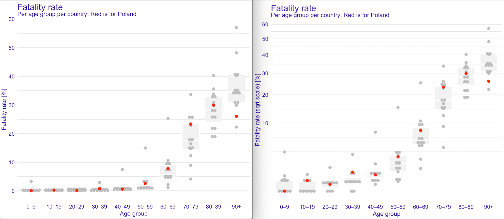
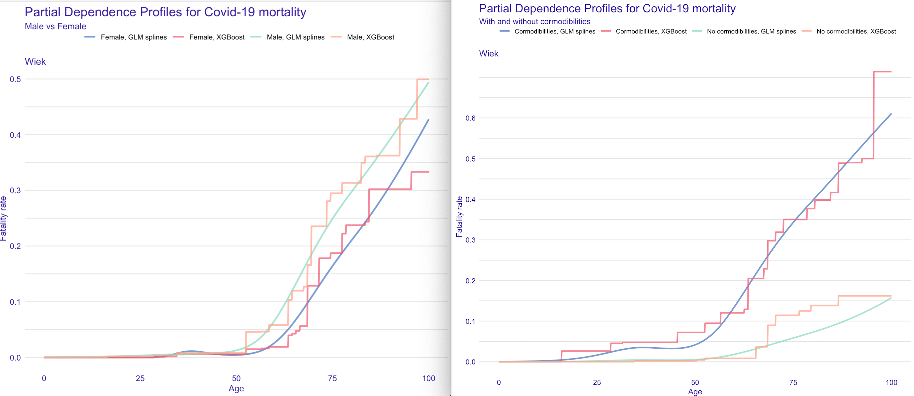

# XAI for modelling of covid-19 mortality for the Polish population

## Crude mortality rates

The covid-19 related mortality reported by different countries is most often reported in age groups. 
The following graphs summarize [these statisitcs](https://en.wikipedia.org/wiki/Mortality_due_to_COVID-19).

## Can we get better resolution for these predictions? 

Below we use XGBoost models and logistic regression with linear tail-restricted cubic splines for more accurate mortality prediction.

Model predictions are visualized using Partial Dependence Profiles. Averages are calcualted in Male/Female groups and With/without cormodibilities.

