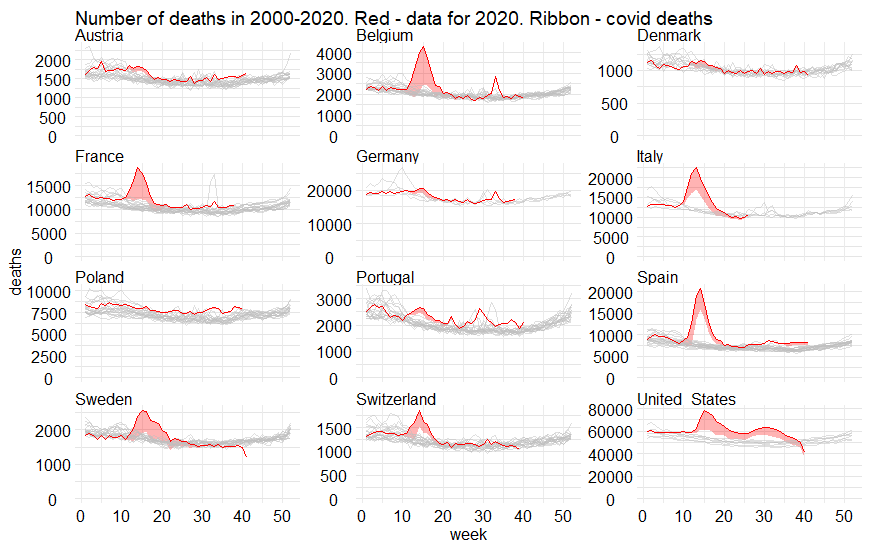

# Liczba zgonów dla 12 krajów (w tym Polski) w latach 2000-2020. 

Dane o zgonach pobrano z projektu The Human Mortality Database (https://www.mortality.org/). Szare linie przedstawiają dane z ubiegłych lat, czerwona linia odpowiada danym z 2020. Dane o zgonach COVID-19 zaznaczono za pomocą czerwonego pola, pochodzą one ze statystyk opublikowanych w serwisie Wikipedia.

