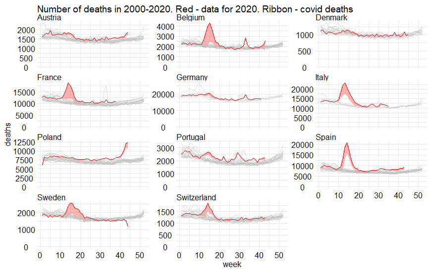
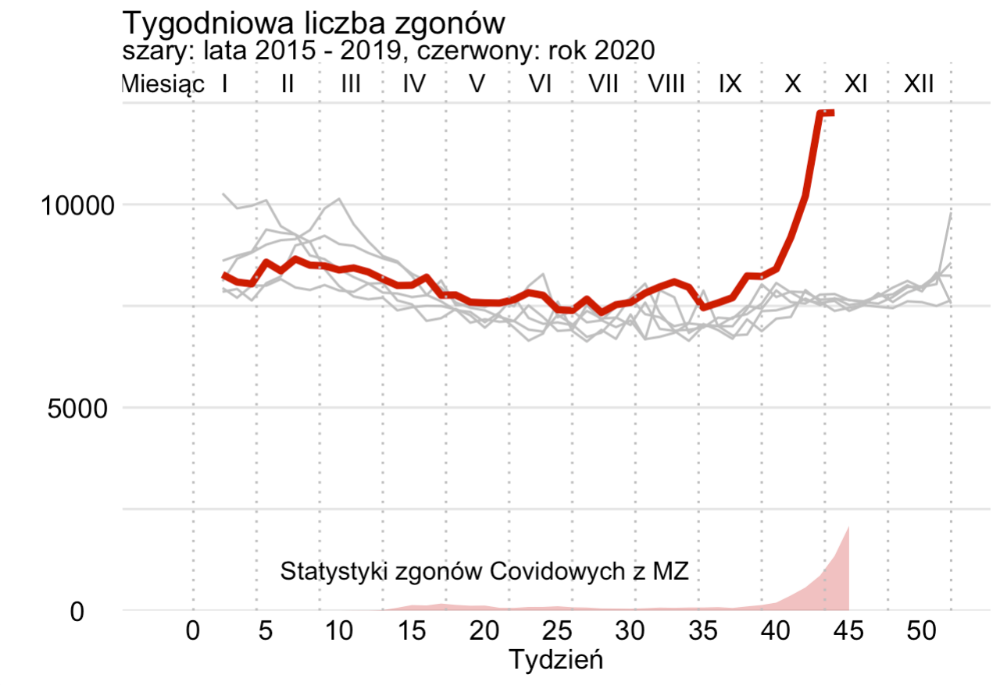

# Liczba zgonów dla 12 krajów (w tym Polski) w latach 2000-2020. 

Dane o zgonach pobrano z projektu The Human Mortality Database (https://www.mortality.org/) oraz ze statystyk ministerstwa. Szare linie przedstawiają dane z ubiegłych lat, czerwona linia odpowiada danym z 2020. Dane o zgonach COVID-19 zaznaczono za pomocą czerwonego pola, pochodzą one ze statystyk opublikowanych w serwisie Wikipedia.

Zgony wszystkie i covid do 44 tygodnia

Zgony wszystkie do 44 tygodnia a covid do 46 tygodnia

Inspirowane przez https://www.ft.com/content/a2901ce8-5eb7-4633-b89c-cbdf5b386938
